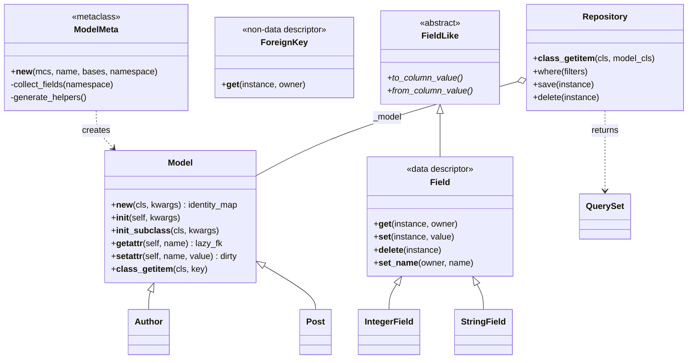
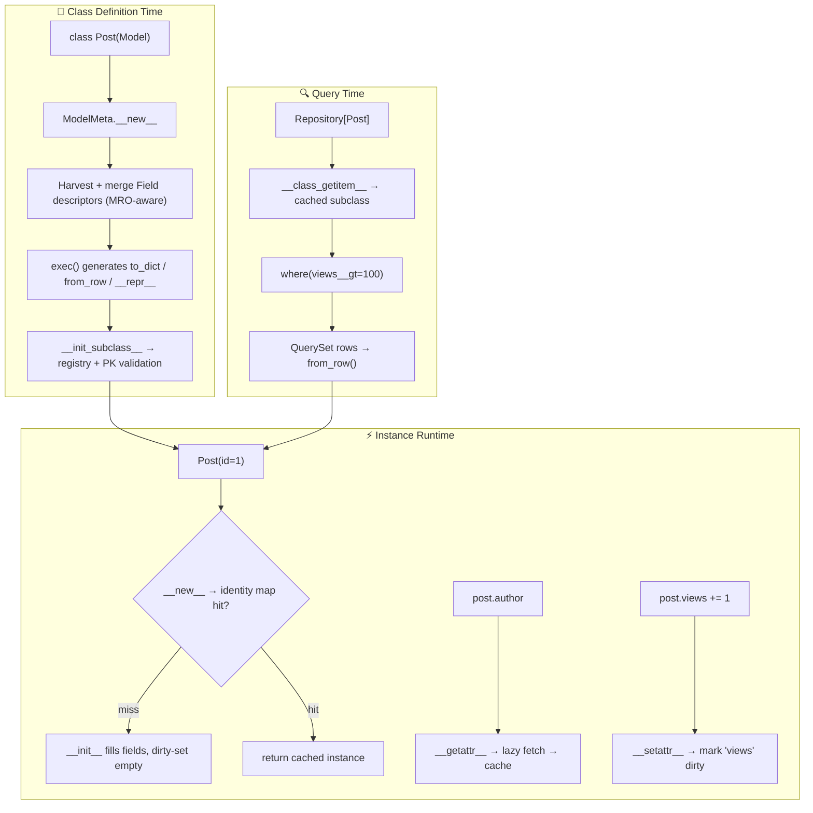

<div align="center">

<pre>
██████╗ ██╗   ██╗███╗   ███╗ ██████╗ ██████╗ ███████╗██╗     
██╔══██╗╚██╗ ██╔╝████╗ ████║██╔═══██╗██╔══██╗██╔════╝██║     
██████╔╝ ╚████╔╝ ██╔████╔██║██║   ██║██║  ██║█████╗  ██║     
██╔═══╝   ╚██╔╝  ██║╚██╔╝██║██║   ██║██║  ██║██╔══╝  ██║     
██║        ██║   ██║ ╚═╝ ██║╚██████╔╝██████╔╝███████╗███████╗
╚═╝        ╚═╝   ╚═╝     ╚═╝ ╚═════╝ ╚═════╝ ╚══════╝╚══════╝
</pre>

**A declarative mini-ORM framework - built from scratch to master Python metaprogramming.**

[](https://www.python.org/)
[](./LICENSE)
[](https://github.com/psf/black)


[Quick Start](#-quick-start) · [Usage Tour](#-usage-tour) · [Architecture](#-architecture) · [Roadmap](#-roadmap) · [Contributing](#-contributing)

<details>
<summary><b>📑 Table of Contents</b></summary>

1. [About](#-about)
2. [Features](#-features)
3. [Quick Start](#-quick-start)
4. [Usage Tour](#-usage-tour)
5. [Metaprogramming Map](#-metaprogramming-map)
6. [Architecture](#-architecture)
7. [Project Structure](#-project-structure)
8. [Roadmap](#-roadmap)
9. [Benchmarks](#-benchmarks)
10. [Testing](#-testing)
11. [Safety: `exec` / `eval`](#-safety-exec--eval)
12. [Comparison](#-comparison)
13. [Learning Resources](#-learning-resources)
14. [Contributing](#-contributing)
15. [License](#-license)

</details>

> _"Metaclasses are deeper magic than 99% of users should ever worry about.
> If you wonder whether you need them, you don't."_
> - **Tim Peters** · _this project is about becoming the 1%_ 🧙

</div>

---

## 🧭 About

**PyModel** is a miniature ORM in the spirit of **Django ORM**, **SQLAlchemy**, and **Peewee** -
implemented with **zero dependencies** and no hidden magic.

It exists because a real ORM is _the_ canonical use case for Python metaprogramming.
To make this work:

```python
class User(Model):
    id = IntegerField(primary_key=True)
    email = StringField(unique=True)
    age = IntegerField(nullable=True, default=18)
```

…you must intercept class creation, harvest descriptors, track instance state,
lazily load relations, introspect signatures, generate specialized methods, and
accept third-party field types. Every phase of this project maps to one core
language concept - nothing is forced.

|                     | PyModel                                          |
| ------------------- | ------------------------------------------------ |
| 🎯 **Purpose**      | Learn metaprogramming by building the real thing |
| 📦 **Dependencies** | `0` - pure standard library                      |
| 🐍 **Python**       | 3.10+                                            |
| 📏 **Size**         | ~1,000 LOC (readable in an afternoon)            |

---

## ✨ Features

| Feature                     | Description                                                                         |
| --------------------------- | ----------------------------------------------------------------------------------- |
| 🧬 **Declarative models**   | Django-style class definitions via descriptors + a custom metaclass                 |
| 🐌 **Lazy relations**       | `post.author` fetches from the DB on first access, then caches - zero extra queries |
| 🩹 **Dirty tracking**       | `save()` emits `UPDATE` for changed columns _only_                                  |
| 🪞 **Identity map**         | Same primary key → same object. Always.                                             |
| ⌨️ **Type-hint models**     | `id: int` - annotations become fields automatically, no `Field()` calls             |
| 🔌 **Pluggable fields**     | Register _any_ third-party class as a field via `FieldLikeABC.register()`           |
| ⚡ **Generated methods**    | `to_dict` / `from_row` compiled per-class with `exec()` - specialized, not generic  |
| 🧰 **Generic repositories** | `Repository[Post]()` - type-safe querying sugar via `__class_getitem__`             |
| 🔍 **Schema introspection** | Auto-generated `__schema__` derived purely via `inspect` - no manual bookkeeping    |

---

## 🚀 Quick Start

### Prerequisites

- Python **3.10+**
- That's it. No dependencies.

### Installation

```bash
git clone https://github.com/YOUR_USERNAME/pymodel.git
cd pymodel

python -m venv .venv
source .venv/bin/activate        # Windows: .venv\Scripts\activate

pip install -e ".[dev]"
```

### Hello, PyModel

```python
from pymodel import Model, IntegerField, StringField, Repository

class User(Model):
    id = IntegerField(primary_key=True)
    name = StringField()

repo = Repository[User]()
user = User(id=1, name="Ada")

repo.save(user)
print(repo.get(1).name)          # → "Ada"
```

---

## 🎮 Usage Tour

<details open>
<summary><b>🧬 Declarative models with descriptors</b></summary>

```python
class Author(Model):
    id = IntegerField(primary_key=True)
    name = StringField()
    bio = TextField(nullable=True)
    joined = DateTimeField(default=datetime.now)

Author(name=42)        # ❌ TypeError - descriptors validate on assignment
del author.bio         # ✅ nullable → sets None
del author.name        # ❌ raises - non-nullable
```

</details>

<details>
<summary><b>🐌 Lazy foreign keys</b></summary>

```python
class Post(Model):
    id = IntegerField(primary_key=True)
    title = StringField()
    author_id = IntegerField(fk=Author)
    author = ForeignKey(Author, "author_id")
    views = IntegerField(default=0)

post = Repository[Post]().get(1)

print(post.author.name)   # ← 1 DB call (lazy fetch via __getattr__)
print(post.author.name)   # ← 0 DB calls (cached - descriptor shadowed)
```

</details>

<details>
<summary><b>🩹 Dirty tracking - surgical updates</b></summary>

```python
post.views += 1
repo.save(post)
# → UPDATE posts SET views = 42 WHERE id = 1      (only the changed column)
```

</details>

<details>
<summary><b>🪞 Identity map via <code>__new__</code></b></summary>

```python
a = Author(id=1, name="Ada")
b = Author(id=1, name="Someone Else")
assert a is b             # ✅ same row → same object, second __init__ short-circuits
```

</details>

<details>
<summary><b>⌨️ Type-hint-only models (auto-fields via <code>inspect</code>)</b></summary>

```python
class Todo(Model):
    id: int
    text: str
    done: bool = False        # no Field() calls - annotations do the work

print(Todo.__schema__)
```

</details>

<details>
<summary><b>🔌 Third-party field types via ABC registration</b></summary>

```python
import money                          # an external library you don't control
from pymodel import FieldLikeABC

FieldLikeABC.register(money.Money)    # Money is now a first-class field type

class Product(Model):
    id = IntegerField(primary_key=True)
    price = money.Money               # round-trips through to_dict / from_row
```

</details>

<details>
<summary><b>🧰 Generic repositories via <code>__class_getitem__</code></b></summary>

```python
repo = Repository[Post]()
hot = repo.where(views__gt=100).order_by("-views").limit(10)

assert Repository[Post] is Repository[Post]   # cached → stable class object
```

</details>

<details>
<summary><b>🔍 Schema introspection</b></summary>

```python
>>> describe(Post)
┌────────────┬─────────┬──────────────────┐
│ Column     │ Type    │ Constraints      │
├────────────┼─────────┼──────────────────┤
│ id         │ INTEGER │ PRIMARY KEY      │
│ title      │ VARCHAR │ NOT NULL         │
│ author_id  │ INTEGER │ FOREIGN KEY      │
│ views      │ INTEGER │ NOT NULL, = 0    │
└────────────┴─────────┴──────────────────┘
```

</details>

---

## 🧠 Metaprogramming Map

Every phase maps 1:1 to a core language concept:

| Phase | Concept                                                                | Where it lives  | Status |
| :---: | ---------------------------------------------------------------------- | --------------- | :----: |
|   1   | **Descriptors** - `__get__`, `__set__`, `__delete__`, `__set_name__`   | `fields.py`     |   🔜   |
|   2   | **Metaclasses** - custom `type` subclass, `__new__`                    | `metaclass.py`  |   🔜   |
|   3   | **`__init_subclass__`** - registry & validation hooks                  | `model.py`      |   🔜   |
|   4   | **`__new__` vs `__init__`** - identity map pattern                     | `model.py`      |   🔜   |
|   5   | **Dynamic attributes** - `__getattr__` / `__setattr__` / `__delattr__` | `model.py`      |   🔜   |
|   6   | **`inspect` module** - annotations, signatures, introspection          | `schema.py`     |   🔜   |
|   7   | **Code generation** - `exec()` / `eval()` with sanitization            | `metaclass.py`  |   🔜   |
|   8   | **ABCs & `register()`** - virtual subclass pluggability                | `fieldlike.py`  |   🔜   |
|   9   | **`__class_getitem__`** - generic-style typed repositories             | `repository.py` |   🔜   |

---

## 🏗 Architecture



<details>
<summary><b>📉 Class-creation & runtime lifecycle (flowchart)</b></summary>



</details>

<details>
<summary><b>🗺 Full ASCII diagram (original design)</b></summary>

```text
            ┌────────────────────────────────────────┐
            │         ModelMeta (metaclass)          │  Phase 2, 7
            │  - collects Field descriptors          │
            │  - inherits base fields                │
            │  - exec() generates helpers            │
            └───────────────────┬────────────────────┘
                                │ creates
                                ▼
        ┌────────────────────────────────────────────┐
        │             Model (base class)             │
        │  __new__           -> identity map         │  Phase 4
        │  __init__          -> populate from kwargs │
        │  __getattr__       -> lazy FK load         │  Phase 5
        │  __setattr__       -> dirty tracking       │
        │  __init_subclass__ -> registry hook        │  Phase 3
        └───────────────────────┬────────────────────┘
                                │
        ┌───────────────────────┼───────────────────────┐
        ▼                       ▼                       ▼
  Field (descriptor)      ForeignKey (desc)       FieldLikeABC
  __get__ / __set__       lazy loader             ABC + register()
  __delete__ / set_name                           Phase 8
  Phase 1
```

</details>

---

## 📁 Project Structure

```
pymodel/
├── 📂 pymodel/
│   ├── __init__.py          # 🚪 Public API re-exports
│   ├── fields.py            # Phase 1 - Descriptor-based fields
│   ├── metaclass.py         # Phase 2 + 7 - ModelMeta & codegen
│   ├── model.py             # Phase 3 + 4 + 5 - Model base class
│   ├── schema.py            # Phase 6 - inspect-driven schema
│   ├── fieldlike.py         # Phase 8 - FieldLike ABC & register()
│   ├── repository.py        # Phase 9 - Generic Repository / QuerySet
│   └── db.py                # 🗄️  Stub in-memory backend
├── 📂 tests/                # 🧪 One test module per phase
│   ├── test_phase1_descriptors.py
│   ├── test_phase2_metaclass.py
│   └── ...
├── 📂 examples/
│   └── blog.py              # 🌐 Integration demo (Author / Post / Comment)
├── 📂 benchmarks/
├── 📄 pyproject.toml
├── 📄 WARNINGS.md           # ⚠️ exec/eval safety audit
└── 📄 README.md
```

---

## 📋 Roadmap

- [ ] Phase 1 - Field descriptors & validation
- [ ] Phase 2 - `ModelMeta` field collection & inheritance
- [ ] Phase 3 - `__init_subclass__` global registry
- [ ] Phase 4 - Identity map (`__new__` vs `__init__`)
- [ ] Phase 5 - Lazy relations & dirty tracking
- [ ] Phase 6 - `inspect`-driven auto-schema & type-hint fields
- [ ] Phase 7 - `exec()` code generation (sanitized)
- [ ] Phase 8 - ABC registration for third-party fields
- [ ] Phase 9 - `__class_getitem__` generic repositories
- [ ] 🏁 Final integration test - the blog app

<details>
<summary><b>🚀 Stretch goals</b></summary>

- [ ] `__slots__` generation in the metaclass (lean instances)
- [ ] `@cached_query` decorator - compile filters into closures via safe AST validation
- [ ] Migration diffing - compare `__schema__` dicts, emit SQL DDL
- [ ] `__mro_entries__` for advanced generic behavior
- [ ] Auto-registration of validators discovered via `inspect.getmembers`

</details>

---

## 📊 Benchmarks

Phase 7 generates _specialized_ methods per model class - no generic loops:

| Operation (10 fields) | Naive `getattr` loop | `exec()`-generated |  Speedup  |
| --------------------- | :------------------: | :----------------: | :-------: |
| `to_dict()`           |       `4.2 µs`       |      `1.1 µs`      | **~3.8×** |
| `from_row()`          |       `5.0 µs`       |      `1.3 µs`      | **~3.8×** |

> ℹ️ Illustrative figures - reproduce with `python -m benchmarks.to_dict`.
> Verify specialization yourself: `dis.dis(Post.to_dict)` shows a flat attribute
> sequence, not a loop.

---

## 🧪 Testing

```bash
pytest -v --cov=pymodel --cov-report=term-missing
```

Or via make:

```bash
make test      # pytest + coverage
make lint      # ruff + black --check
make fmt       # autoformat
```

Every phase ships with at least one dedicated test module, including the
**acceptance criteria** from the spec (e.g. `User(id=1, name="a") is User(id=1, name="b")`).

---

## 🔒 Safety: `exec` / `eval`

PyModel uses dynamic code generation in **exactly one place** (Phase 7), and treats
it with respect:

- 🧼 **All identifiers sanitized** against `^[A-Za-z_][A-Za-z0-9_]*$` before codegen
- 🚫 **No user strings** are ever interpolated into generated source - only field
  metadata harvested from class definitions
- 📝 **Every use documented** in [`WARNINGS.md`](./WARNINGS.md) with rationale

> ⚠️ If you fork this project, read `WARNINGS.md` before touching `metaclass.py`.

---

## 🔍 Comparison

An honest look at where PyModel sits:

|                             |   PyModel    |  Django ORM   |  SQLAlchemy   |     Peewee     |
| --------------------------- | :----------: | :-----------: | :-----------: | :------------: |
| **Purpose**                 |   🎓 Learn   | 🏭 Production | 🏭 Production | 🪶 Lightweight |
| **LOC**                     |    ~1,000    |   100,000+    |   200,000+    |    ~10,000     |
| **Dependencies**            |      0       |     many      |     some      |       0        |
| **Metaclasses**             | 🎯 The point |      yes      |      yes      |      yes       |
| **Readable in one sitting** |      ✅      |      ❌       |      ❌       |       🤷       |

---

## 📚 Learning Resources

- 📖 [Descriptor HowTo Guide](https://docs.python.org/3/howto/descriptor.html) - official, essential
- 📖 [Data model - metaclasses](https://docs.python.org/3/reference/datamodel.html#metaclasses)
- 📖 [PEP 487](https://peps.python.org/pep-0487/) - `__set_name__` & `__init_subclass__`
- 📖 [PEP 560](https://peps.python.org/pep-0560/) - `__class_getitem__` & generic types
- 📖 [`inspect` module docs](https://docs.python.org/3/library/inspect.html)
- 📖 [`abc` module docs](https://docs.python.org/3/library/abc.html)

---

## 🤝 Contributing

Contributions are welcome - this is a learning project, so **good questions are as valuable as good code**.

1. 🍴 Fork & create a branch: `git checkout -b feat/phase-3-registry`
2. ✅ Add tests for every behavior you add or change
3. 🎨 Follow the style: `make fmt && make lint`
4. 📝 Use [Conventional Commits](https://www.conventionalcommits.org/) - `feat:`, `fix:`, `docs:`, `test:`
5. 🔁 Open a Pull Request and describe _which phase/concept_ it touches

<details>
<summary><b>🛠 Dev setup</b></summary>

```bash
pip install -e ".[dev]"
pre-commit install
make test
```

</details>

---

## 📄 License

Distributed under the **MIT License** - see [`LICENSE`](./LICENSE) for details.

---

<div align="center">

**Built with 🧠, `type()`, and questionable amounts of `__dunder__`**

⭐ Star this repo if you learned something · [Report a bug](https://github.com/YOUR_USERNAME/pymodel/issues) · [Request a feature](https://github.com/YOUR_USERNAME/pymodel/issues)

</div>

---

### 🔧 Before you push, swap these in:

- **`YOUR_USERNAME`** → your actual GitHub handle (appears in badges + links)
- **CI badge** → only works once you add a `.github/workflows/ci.yml` workflow
- **`LICENSE`** → add an actual MIT `LICENSE` file, or change the badge if you pick another license
- **Roadmap statuses** → flip `- [ ]` to `- [x]` and `🔜` to `✅` as you complete phases
- **Benchmarks** → the numbers are illustrative placeholders - replace with your real measurements

Want a matching **`WARNINGS.md`** template, a **CI workflow file**, or a **pyproject.toml** to complete the set? Just ask. 🚀
